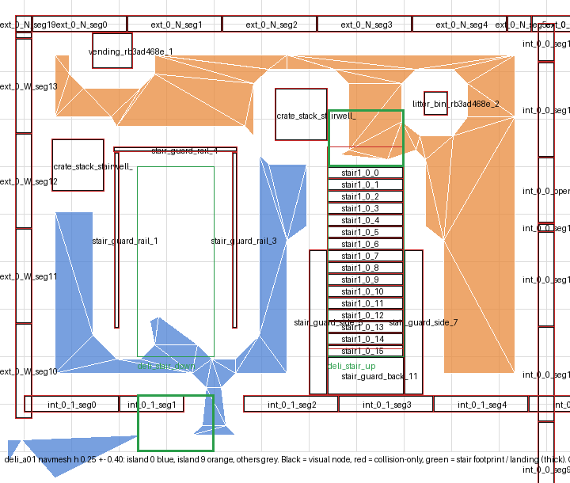

# deli_a01's upper storey was cut off from the street in 9188's site bake

Measured 2026-10-06. **Fixed in Deli Counter 0.194.0 and 0.195.0, gated by
0.196.0, and proven in a level.** In cold run 9189 (0 interventions;
`docs/cold_runs/cold_9189/NOTES.md`), deli_a01's only island of its own is
its roof. The street's island covers its basement, ground floor, stair and
upper storey: 17,728 m2, against 16,944 in 9188. Roadmap item 194, CLOSED.

**The artefact, and what made it.** `run_bake_sweep.py --dump`
(`docs/findings/stairwell_on_one_grid_in_four/`) of
`res://site_navqa.tscn` in the WALK-TEST staging of cold run 9188's picked
candidate, seed_9104:
`workspaces/cold-9188-ws/.level_factory/staging/restaurant_row_001.walktest_navqa.candidate.seed_9104`.
The bake has 165 islands, and island 0 holds the home point and 16,944 m2:
the street. The site spec the instruments read footprints from is the
laser_tag_evaluate staging's `site.site.drawn.json`. All four stagings of
9187 and 9188 hold the same file (md5 `a022f8f17378`), so the pairing is
one build.

**Refuted, kept.** The first version of this README said the bake was of
"the scene Laser Tag grades". It was the walk-test scene; only the site
spec came from Laser Tag's staging.

**Frames and units.** Level (x, y) is Godot (x, -z). The building frame is
level minus deli_a01's `at`, (-58, 1.01), rot 0, which is the frame of
`deli_counter/build/deli_a01.gameplay.json` and of its spec. Heights are
navmesh polygon heights in metres:
- ground floor 0.25;
- story 1 3.55;
- roof 6.85;
- basement -3.05.

## What was reachable

The ground floor and the basement were island 0, at both doors. The upper
storey was not:
- island 9: 592 m2, the up-stair and story 1's hall, office and apartment;
- island 10: 186 m2, the server room.

**Refuted, kept:** "778 m2 of deli_a01 is disconnected from the street", as
first reported in conversation. The area was right; the implication that
the deli was shut was wrong.

**9187 was cut off the same way.** Baked identically, its islands were
595 m2 and 186 m2. deli_a01's GLB differs between the two runs, because
Deli Counter 0.192.0 refurnished it, so 0.192.0 did not do this. The
roadmap-190 proof in 9187 was deli_a03's stair, not deli_a01's; this
building's upper storey may never have connected.

## Break 1: two crate stacks shut the up-stair's foot

Blue is the street's island and orange is island 9; black outlines are
visual nodes and red are collision-only. Green is a stair's footprint, and
thick green is a landing (`stairwell_plan.py`).

**The stair splits the stairwell.** The up-stair runs from the stairwell's
south wall to its foot at y 11.4, with its side and back guards. So the only
ways from the stairwell's door (`office_stair_door`, south wall, x -15) to
the stair's foot landing (x -12.6..-11.0, y 11.0..12.2) run north past it.
Two crate stacks `seed_cover` placed shut both:

| piece | at (building frame) | passages it leaves | today's seeder rule |
|---|---|---|---|
| `crate_stack_stairwell_0` | x -13.71..-12.61, y 11.54..12.64 | 0.79 m to the down-stair's guard corner; 0.54 m to the up-stair's first tread (0.21 m tall, over the 0.15 m climb) | refuses it: 0.01 m off the foot landing, stale |
| `crate_stack_stairwell_1` | x -18.42..-17.33, y 10.47..11.57 | 0.40 m to the west wall's inner face; 0.23 m to the down-stair's guard | allows it |

**Why 0.8 m.** The bake erodes `ceil(0.4 / 0.1)` cells, 0.4 m, from every
obstacle, so a passage needs at least 0.8 m. The first measurement, a 0.41 m
"seam" at building (-14.10, 11.44), was the two eroded regions' corners
meeting diagonally between the crate and the guard. It was not an obstacle
standing in a gap.

**Why the rules let it.** Each of `_seed_clear`'s margins was a fraction of
a body:
- 0.3 m off a stair's reserve;
- 0.9 m off a volume;
- 1.0 m from a partition's LINE to the piece's centre;
- nothing off an exterior wall.

Across the library: 69 seeded pieces in 128 shells; 23 stale, 35 within
1.1 m of something, 40 either (`seeded_slots_census.py`).

**Why no gate saw it.**
- The circulation gate keeps pieces out of stair and door volumes, and the
  crate was 1 cm outside the landing.
- L23 asks whether a piece is over a hole or in a walk; it was beside one.
- The Godot nav gate proves a stair's two ends join, and they did, both on
  island 9. Nothing asked whether an entrance reaches the stair.

**The fix, Deli Counter 0.195.0.**
- A seeded piece now keeps `min_corridor_width` (1.1 m) from every wall,
  stair reserve and standing volume.
- 35 pieces were moved and 7 dropped across 13 shells. The drops include
  both crates in deli_a01, a02 and a03.
- On 9188's site with the new shell, deli_a01's only island of its own is
  its roof. The street's island covers its basement (783 m2), ground floor
  (672 m2) and stair and upper storey (759 m2). Islands: 165, then 164,
  then 161.

**A side effect, attributed.** 0.195.0 added two lint warnings, 412 to 414,
measured by linting every library spec from git at both commits. Both are
L9 groups the refurnish formed in migrated shells: four identical
0.5 x 2.0 x 1.9 pieces in bank_branch_a03, and four identical
0.6 x 0.6 x 1.0 pieces in deli_a02. **Refuted first, kept:** a parse of the
hook's log put both on warehouse_a02. Neither commit touched that spec, and
it lints identically at both. The parser filed every warning under the last
header it had seen, and the log interleaves its sections. A log is not the
measurement.

**The shell gate sees it too (Deli Counter 0.196.0).** The nav gate's new
entrance check, run on the shipped deli_a01 (9188's GLB with its own
gameplay file):
- both stairs read "ok" and navigable reads "yes", as the old gate always
  said;
- "stairs an entrance reaches: 1/2 -- no entrance reaches stair
  deli_stair_up";
- the fixed shell reads 2/2.

**Across the library, after 0.195.0** (`nav_gate.py --all`):
- 98 shells have judged stairs, 149 stairs in all, and 148 are reached from
  an entrance.
- **The exception is `primos_pizza_stair_0`.** It runs from the basement
  through the ground floor to storey 1; its ends join and all three
  entrances snap, but the ground floor cannot reach it. That is roadmap
  189's discharge neck, frozen in `navgate_baseline.json` with that reason.
- No shell with stairs went unjudged. 14 have no storey-0 exterior door: the
  12 Empties, shut by design, and the two facade shells, which have no
  stairs.

## Break 2: the server room had no door

**What the bake and the spec showed.** Island 10 was `server_room` exactly
(story 1, x -2..19, y 2..14). Its only ways in were two soft-wall breaches,
from the upper hall at (-2, 10) and from the apartment at (10.5, 2), plus
`roofline_breach` in its north wall. It had no door. Its seams with island
9 were all 1.30 m: walls.

**The walker's call (2026-10-06): give it a door.** Deli Counter 0.194.0:
- a 1.25 m door at (-2, 7.0), `hall_to_server_room`, from the upper hall;
- the breach stays;
- on 9188's site with the new shell, island 10 is gone and island 9 grows
  from 592 to 779 m2.

**L24 (WARN) names every room only a breach, window or drop reaches.** 16
rooms in 8 shells were found. The 15 left are frozen for the walker's call
(`walk_reach_census.py`; `deli_counter/walk_reach_baseline.json`):
- the deli family's server rooms, the objective in three of them;
- the deli family's basement utility rooms;
- three apartment rooms;
- rowhouse_raid's kitchen and vault.

## Instruments

| file | what it measures |
|---|---|
| `navmesh_islands.py` | The largest islands other than the largest: area, height range, extent, and what footprint each lies over. Its docstring says "other than the spawn's" while the code skips the LARGEST island. The home point is in the largest here, so the listing holds for these bakes. |
| `door_islands.py` | The island either side of each exterior door or breach, along the wall's normal. Rot 0 only. |
| `island_seams.py` | The closest approaches between two islands in a height band, beside every opening's distance. |
| `glb_region_nodes.py` | Every mesh node of a building GLB touching a box, visual and collision-only, in the building frame. With two GLBs, it prints the diff. |
| `stairwell_plan.py` | The plan above: navmesh polygons by island, nodes in the body band, stair footprints and landings. |
| `swap_and_bake.py` | Copies a staged site, swaps one building's GLB, reimports, and bakes as the original was baked. The before-and-after proof of both fixes. |
| `walk_reach_census.py` | Rooms L12 reaches that a body cannot walk to, across every spec. |
| `seeded_slots_census.py` | Seeded pieces that are stale, or that leave a gap under 1.1 m, across the built library. |

`islands_*.txt` hold the three bakes' island tables: shipped, door, and
door plus corridor.

## Not established

- **Whether a cold run on restaurant_row_001 sees it.** The site proofs here
  swap one shell into 9188's staging; a cold run rebuilds everything.
- **Whether furniture cuts other floors the same way.** Furnish keeps 0.9 m
  from a volume. 4 seeded pieces in 2 shells have furniture 0.9 to 1.1 m
  from them.
- **Whether other shells have stairs no entrance reaches.** The nav gate
  does not ask; that check comes next.
